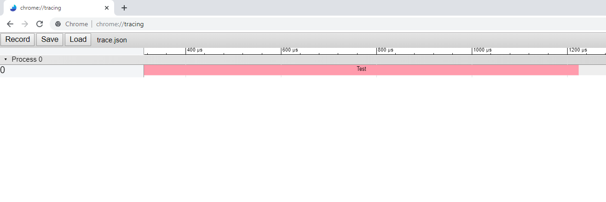

# ChromeTracing.NET
A C# visual profiling library using Google Chrome's [tracing](https://www.chromium.org/developers/how-tos/trace-event-profiling-tool) tool.


## Usage

Whenever you want to measure a piece of code, you just have to use ```ChromeTrace.Profile```, 
and ChromeTracing.NET will do the rest.

```cs 
  public static void Main(string[] args)
  {
      ChromeTrace.Init();

      using (ChromeTrace.Profile("Test"))
      {
          Random rand = new Random();
          int sleep = 1000 + rand.Next(1000);

          Console.WriteLine("Night night!");

          System.Threading.Thread.Sleep(sleep);

          Console.WriteLine($"Woke up after {sleep} ms");
      }
  }
```

When the application ends its execution, a ```trace.json``` file is generated. This file
can be directly loaded to Google Chrome's ```chrome://tracing``` tool.

<p align="center">
  
</p>
